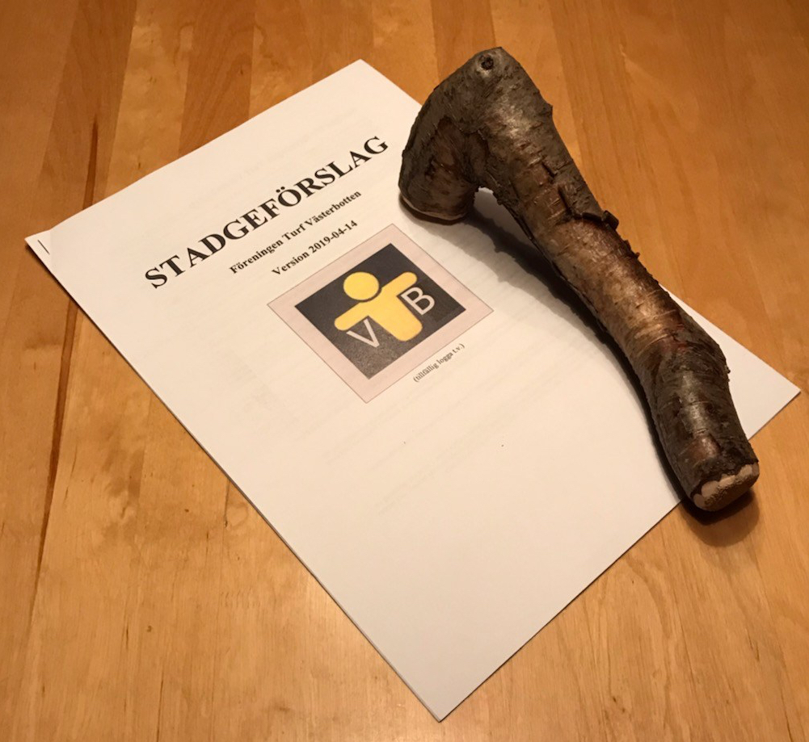

\[caption id="attachment\_166" align="alignleft" width="287"\] Foto: ZoneBanger\[/caption\]

Lördagen den 4 maj bildades föreningen Turf Västerbotten officiellt. Stort tack till alla som kom och var med att ta beslut samt diskuterade föreningens framtida verksamhet. Information från [styrelsen](https://turfvasterbotten.wordpress.com/styrelsen/) kommer att publiceras här på denna webbsida, samt aviseras i andra kanaler. Vi hoppas att inom kort ha en mailadress och information om inbetalning av medlemsavgifter. Föreningen behöver även en logga. Mer information om hur just du kan bidra till denna logga kommer inom kort.

**Kommande aktiviteter**

- 8-9 juni: Midnight Classic 2019. [Läs här för mer information](https://forum.turfgame.com/viewtopic.php?f=131&p=65836&sid=32aec2a154cf7671d52f41dc9e141fe9#p65836).
- 15 juni: Turfrundor i Obbola med möjlighet att prova på SCA-arenan med banor och stigar, gym, boule, grillning, besöka Obbola marknad mm. (Mer info kommer.)
