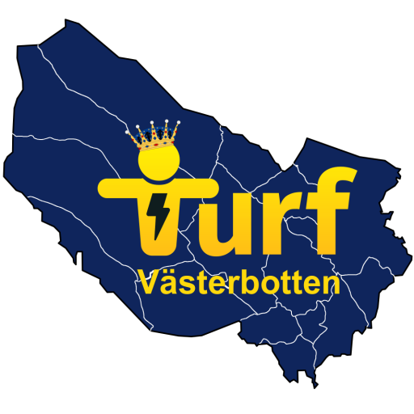

_Uppdaterat 25 februari: Förtydligande gällande inbetalning, formulär och röstberättigande._

Nu är det dags att betala in Medlemsavgiften för 2020. Avgiften för 2020 är för vuxen 120 kr, barn 60 kr och för familjer är totalbeloppet max 240 kr. Instruktioner för [hur du betalar finner du här](https://turfvasterbotten.wordpress.com/bli-medlem/). Glöm inte att märka din betalning med ditt turf-nick. Har du inte varit medlem tidigare behöver du även skicka in formuläret om personuppgifter.

För att vara röstberättigad på årsmötet behöver du ha betalt in din årsavgift innan mötet alternativt på själva årsmötet. Skulle årsavgiften ändras på årsmötet sker återbetalning.

Låter det rörigt? Ja, vi medger att det blivit något snurrigt med medlemsavgift och årsmöte i relation till hur det är formulerat i stadgarna. Därför ser styrelsen nu över stadgarna för att förtydliga och underlätta föreningens arbete framöver. Förslag till stadgeändringar kommer att bifogas kallelsen till årsmötet, som kommer inom kort.

Välkommen som medlem för 2020!

Ps. Passa på att betala in start-avgift för [Västerbotten Winter Classic 2020](https://turfvasterbotten.wordpress.com/vb-winter-classic-2020/) på samma gång! För visst har du anmält dig?
