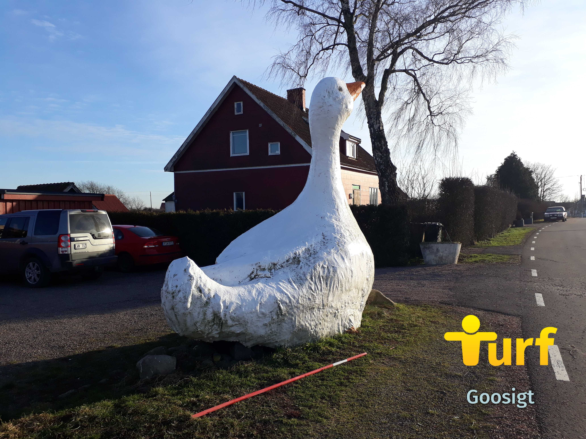

Turf-träffarna läggs som tidigare aviserat på is ett tag framöver. Men föreningen fortsätter att planera för framtiden. Just nu söker vi dig som vill...

... Vara med i **_planeringsgruppen för Västerbotten Winter Classic 2021._** Preliminärt (det beror så klart på pandemin och restriktioner) anordnas Västerbotten Winter Classic 2021 den 27 februari 2021. Vi söker nu dig som är intresserad att vara med att planera eventet. Detta innebär exempelvis att lägga zoner, hålla koll på resultatlistan under eventet, skriva inbjudan, koka kaffe, vakta grillelden...

Västerbotten Winter Classic 2020 med träsk-tema. Vad blir det för tema 2021? Foto: WombaWomba

... Vara med i en _**zonförslagsgrupp för Västerbotten**_. Scott63 har initierat en grupp som syftar till att samordna zonförslag. Är du en fena på att hitta unika platser? Vill du utöka antalet zoner i Bygdsiljum? Är du mästare i att formulera argument som zonläggarna älskar? Kan du alla genvägar i naturområdena? Sitter du på ett geografiskt lexikon över Västerbottens historiska platser som saknar zoner? Givetvis kan alla även i fortsättningen fortsätta att individuellt göra zon-förslag i appen och på Forumet. Gruppens målsättning är att öka chansen att få bra zoner accepterade och därmed förhoppningsvis stimulera och öka turfandet i Västerbotten.

... Vill bidra med en text (och gärna en bild) från _**dina turf-minnen**_. Föreningen söker korta och långa berättelser om turfande för att publiceras här på hemsidan. Det kan vara små reseberättelser från turf-resor, roliga och annorlunda zon-tagningar, en personlig utmaning, din första dag som turfare... Skriv en text på mellan 100 - 1500 ord och bifoga gärna någon eller några bilder (som du har rättigheter till) och skicka till styrelsen. Använd bara turf-nick i texten, inga personnamn.

Zonen Goosigt i Skåne. Foto: WombaWomba.

En intresseanmälan görs lättast genom att skicka ett mail till styrelsens mailadress: turf.vasterbotten (snabel-a) gmail.com. Skriv gärna i ämnesraden ifall det rör VB Winter Classic, zonförslags-gruppen och/eller Turf-berättelse till hemsidan.
