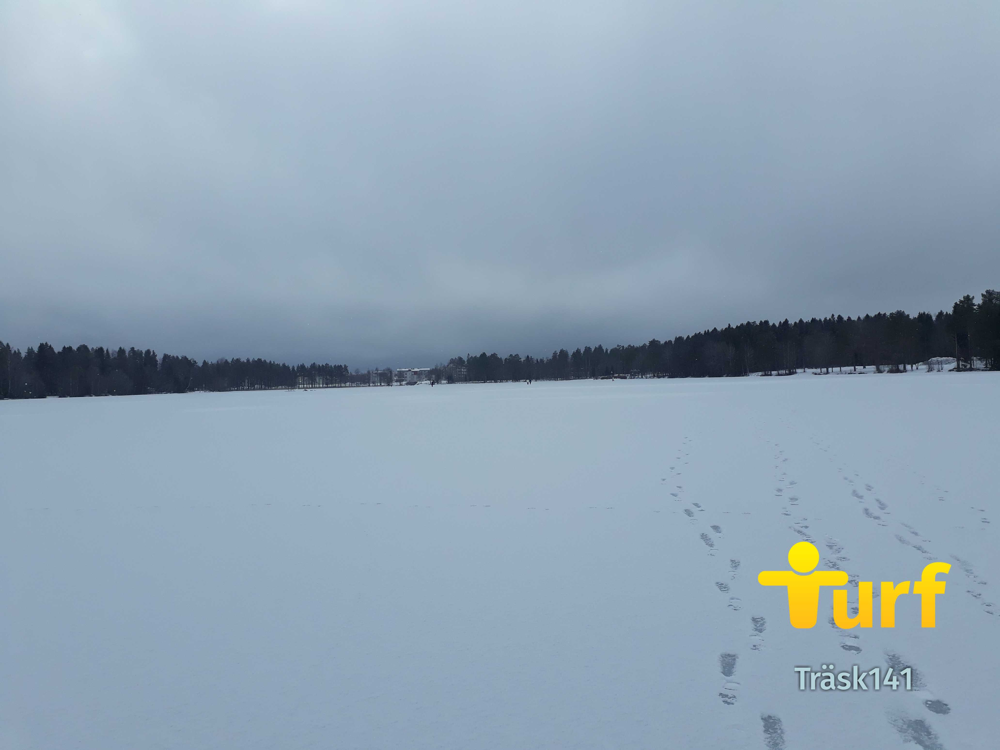
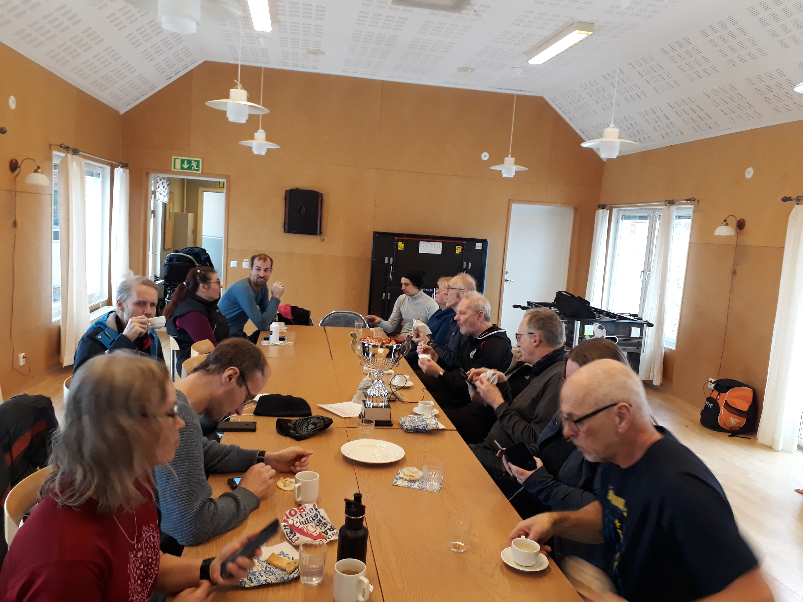
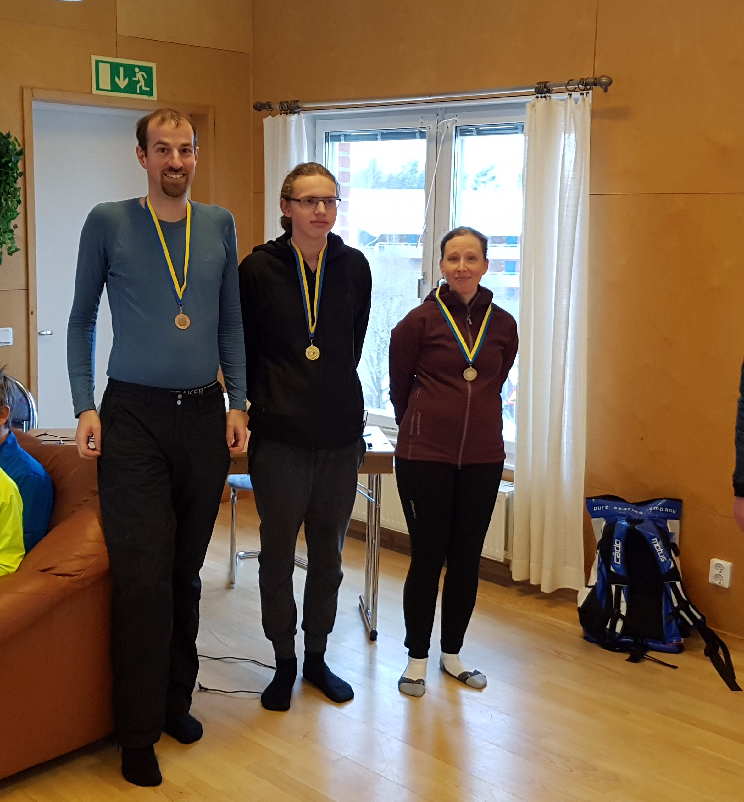
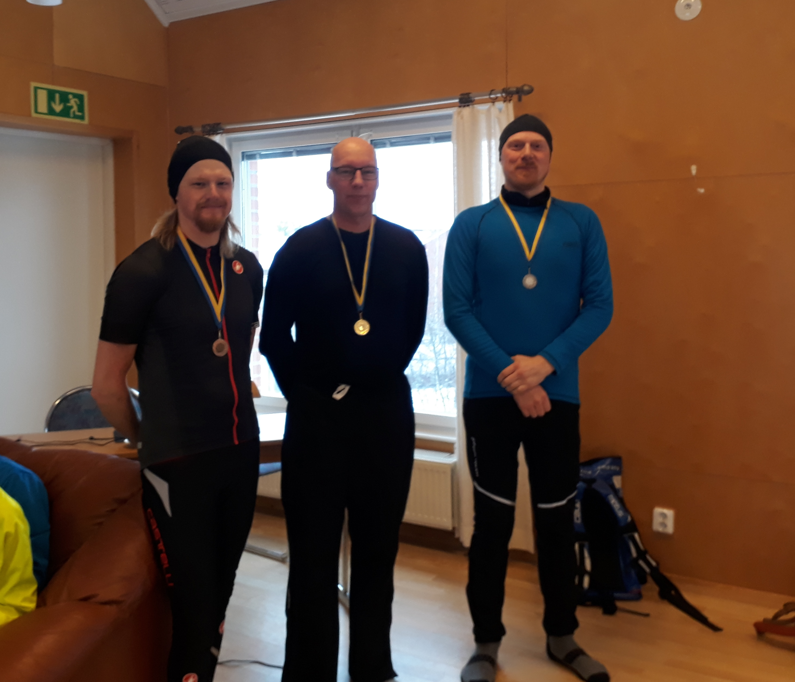
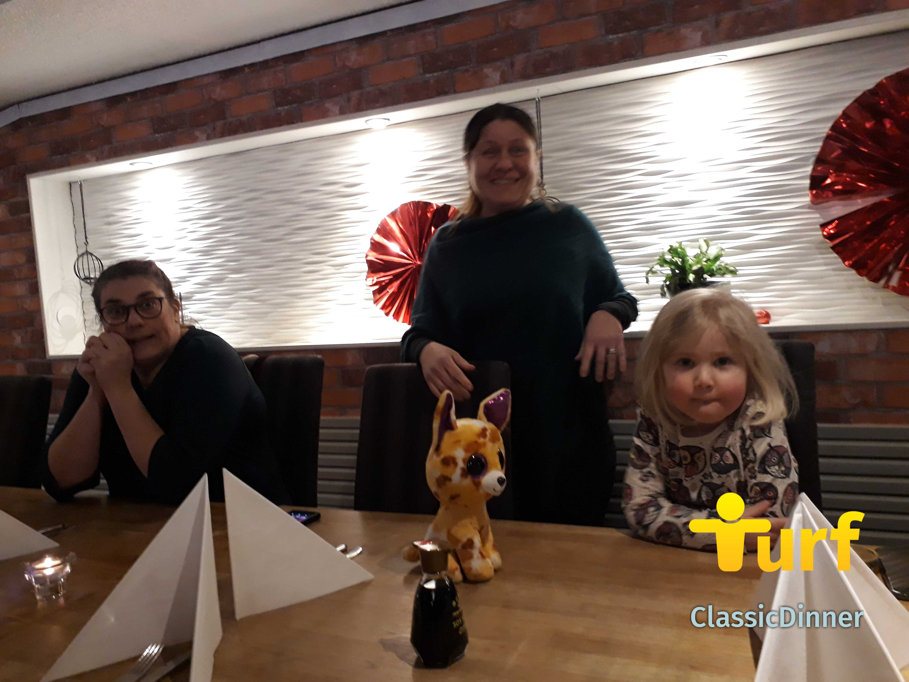

\[caption id="attachment\_503" align="aligncenter" width="4128"\] De Västerbottniska träsk-orterna räckte inte till när anmälningarna trillade in de sista skälvande timmarna. Här Träsk141 mitt på Nydalasjön. Foto: WombaWomba\[/caption\]

\[caption id="attachment\_492" align="alignleft" width="300"\] Inomhuscykelparkering. Foto: WombaWomba\[/caption\]

Efter en vädermässigt skakig inledning på 2020 trodde vi nog att vi skulle behöva pudla efter vårt skryt i inbjudan till ett _riktigt_ vinterevent. Men kylan kom till Umeå, isen lade sig tjockt över Nydalasjön och dagen till ära föll nysnö för att polera upp en perfekt halka. Över 40 turfare med dubbade vinterdäck och skor möttes upp i Tomtebo på skottdagen. Just skottdagen till ära hade en av arrangörerna bytt både cykelmärke och turf-nick: Scott63 (f.d. Ghost63\_Ume).

Temat för Västerbotten Winter Classic 2020 var träsk. Majoriteten av zonerna var döpta efter ortsnamn i Västerbotten innehållande "träsk". T.ex. fanns Bastuträsk och Mensträsk representerade. (För den som vill orientera sig i alla regionens träsk [rekommenderas denna lista](http://www.svenskgeografi.se/soek?kate=P&laen=vaesterbotten&sord=%2Aträsk&sida=1).)

\[caption id="attachment\_494" align="aligncenter" width="4128"\] Efter-event-fika. TantLantz stod för hembakat fika till deltagarnas förtjusning. Foto: WombaWomba.\[/caption\]

Juniorerna gjorde en fantastisk insats. MoiRune placerade sig högre än många av de vuxna trots att han påbörjade eventet drygt 20 minuter efter alla andra! Arvidovitch kom tvåa och Busfrö15 trea. Alla juniorer fick diplom för sina prestationer.

\[caption id="attachment\_490" align="aligncenter" width="2916"\] Juniorerna. Foto: inda7\[/caption\]

Tillreste MaXi sprang hem segern i fotklassen med 1669 poäng. Silvert gick till WombaWomba och bronset till TurfDanne.

\[caption id="attachment\_515" align="aligncenter" width="2366"\] TurfDanne, MaXi & WombaWomba. Foto: Superelak.\[/caption\]

\[caption id="attachment\_498" align="aligncenter" width="425"\] Så här kan det se ut när man springer ett event på två timmar och tar 66 zoner (drygt 11 km). Skärmdump från Runkeeper.\[/caption\]

I cykelklassen segrade cotten med 2274 poäng, tätt följt av Superelak (silver) och MrJokerit (brons). Hela resultatlistan finns på [Eventsidan på Turfgame](https://turfgame.com/event_old?id=2536).

\[caption id="attachment\_495" align="aligncenter" width="2938"\] MrJokerit, cotten & Superelak. Foto: WombaWomba\[/caption\]

Slutligen delades special-priset ut till de tre deltagare som rest längst för att delta i eventet. Givetvis bestod detta pris av Västerbottensost i olika former! Det var nämligen långt ifrån endast Umeå-turfare på eventet. Turfare kom från Skellefteå, Luleå, Lycksele, Holmsund/Obbola, Dalarna, Göteborg och Uppsala.

\[caption id="attachment\_496" align="aligncenter" width="3577"\] MrJokerit, MaXi & Kygni kammade hem Västerbottensost. Foto: WombaWomba.\[/caption\]

Västerbotten Winter Classic 2020 var första eventet anordnat helt i föreningens regi. Eventgruppen har jobbat hårt med zon-läggning, marknadsföring, leda sekretariatet, lokalbokning, baka fika m.m. Att döma av deltagarnas nöjdhet förtjänar gruppen en eloge!

\[caption id="attachment\_497" align="aligncenter" width="3781"\] En välorganiserad projektgrupp som kan vara väldigt stolta över ett välgenomfört event. inda7, scott63, linkaz, Bont och TantLantz (saknas på bild PaltN). Foto: WombaWomba.\[/caption\]

På kvällen anordnades turf-middag på Restaurang Balder som dagen till ära prytts av en särskild zon. Assist- och crowdy-medaljer regnade in på deltagarna medan de intog en buffé bestående av bland annat tacos, sushi, indisk mat, kinesisk mat, lax, glass och skumtomtar. Då bankettbordet var så långt fick vissa kommunicera med hjälp av turf-chatten...

\[caption id="attachment\_499" align="aligncenter" width="4128"\] Såväl rutinerade som nybörjarturfare deltog. Foto: WombaWomba.\[/caption\]

\[caption id="attachment\_501" align="aligncenter" width="3832"\] Ena halvan av bordet. Foto: WombaWomba.\[/caption\]

Tack till eventgruppen och alla deltagare för ett trevligt event!

_För rapporten: WombaWomba._
