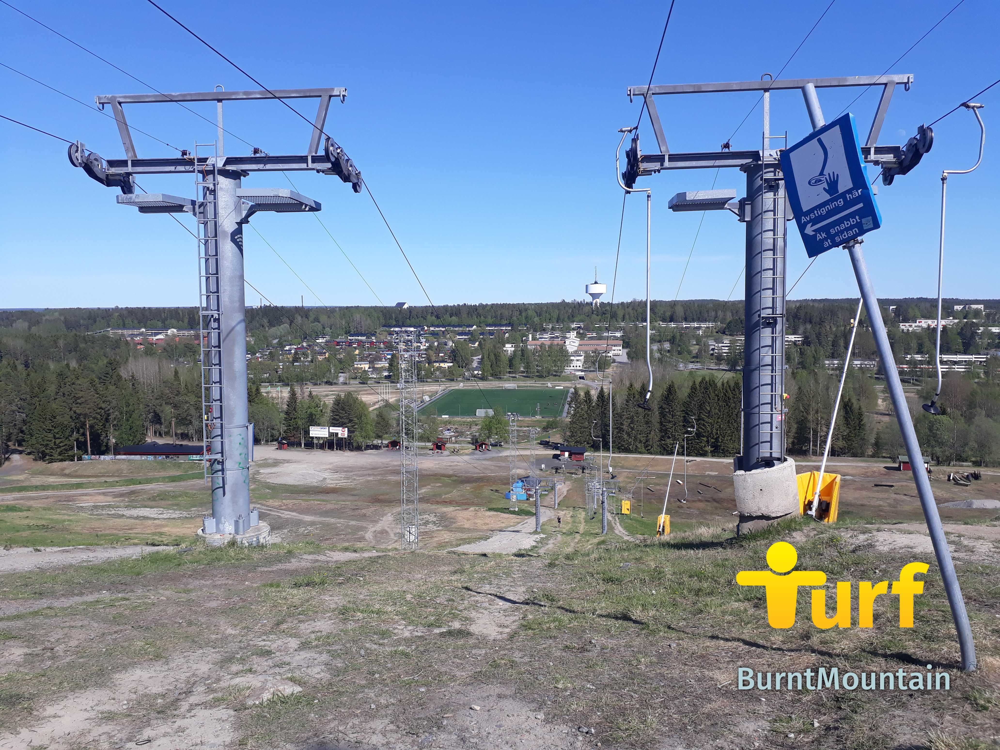

**Uppdaterat 18/6:** Det är något galet med anmälningsformuläret. Får du det inte att fungera så maila din anmälan till turf.vasterbotten @ gmail .com

Vi vet att ni har väntat. Nu kommer detaljerna för Midnight Classic 2020. Arrangören Föreningen Turf Västerbotten hälsar alla intresserade välkomna till eventet. Eventet är öppet, vilket ger dig eventor-medaljen i appen.

När: Lördag 27 juni - söndag 28 juni Var: Vid foten av Bräntberget, nära [zonen YouRaiseMeUp](https://turfgame.com/map/YouRaiseMeUp) Samling: 22.30 Genomgång : 22.40 Eventtid: 23:00 - 01:00 Återsamling: 01:20 Prisutdelning 01:30

Information om klasser, anmälning, startavgift, regler och allt annat du önskar veta finner du i den bifogade inbjudan: [Inbjudan till Midnight Classic 2020.](https://turfvasterbotten.files.wordpress.com/2020/06/inbjudan-till-midnight-classic-2020.pdf "Inbjudan till Midnight Classic 2020") I närheten av Bräntberget finns parkeringsplatser vilka du ser [på denna parkeringskarta.](https://turfvasterbotten.files.wordpress.com/2020/06/mc-2020-p-plats.pdf "MC 2020 P-plats")

\[caption id="attachment\_684" align="alignnone" width="4128"\] Toppen av Bräntberget i dagsljus. Foto: WombaWomba.\[/caption\]

Årets upplaga, den 7:e i ordningen, blir något annorlunda pga rådande situation. Vi ber alla deltagare att hålla avstånd till varandra vid samlingsplatsen. Mår du lite krasst, ber vi dig att följa eventet via "turf-tv" (dvs mobil eller dator).

Varmt välkomna!
