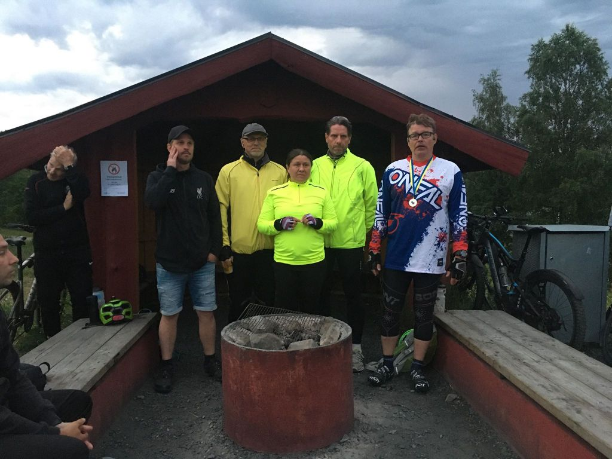

_Uppdaterad 2 juli med resultatlista._

Natten mellan lördag och söndag 27-28 juni samlades 47 turfare för årets upplaga av Midnight Classic i Umeå. Deltagarna, som var indelade i fot- och cykelklass, kom bland annat från Luleå, Piteå, Skellefteå, Öravan, Vännäs, Umeå, Täfteå och Uppsala. Bland dessa fanns både turfare som deltog i event för första gången och vana turfare med erfarenhet från både event och bonanzor. Kul!

Efter några dagars galen värmebölja hade temperaturen sjunkit till mer hanterliga 14 grader lagom till eventet och mot slutet föll också ett milt duggregn. Himlen var spektakulärt rosalila.

Draken försökte skydda Umeå medelst fulblock. Den gubben gick inte! Foto: Ninetail

Sommarnatt. Foto: Ninetail

Nytt för i år var att föreningen Turf Västerbotten höll i arrangemanget. Medaljerna hade därför den nya loggan.

Nya medaljerna. Foto: ZoneBanger

Tävlingsområdet var också nytt. Samlingsplats var zonen _Youraisemeup_ vid Bräntberget. För att kunna hålla samlingen före och efter tävlingsmomentet på ett säkert coronaavstånd hade arrangörerna valt en samlingsplats med tre rejäla grillplatser och stora fria ytor runtomkring. Tyvärr slog det traditionsenliga eldningsförbudet till innan eventet hunnit börja men som tur är vet turfare hur man håller värmen ändå!

Samling innan eventet. ParkMan visar snyggtröjan. Foto: Ninetail

Tävlingsområdet. Foto: Ninetail

Linkaz, Scott63, TantLantz och tre miljoner mygg höll koll på både packningar och tävlande. Foto: Ninetail.

Kygni tog den enda vattenzonen och höll den genom hela eventet. Kottson fick batteristrul och fick återvända till samlingsplatsen för att låna powerbank av TantLantz.

Kottson i desperat jakt på ladd. Foto: Ninetail

Efter tävlingen blev det prisutdelning till vinnarna av fot- och cykelklassen samt utdelning av Västerbottensost till de långväga deltagarna. Det hurrades också för arrangörerna och Bont passade på att berätta om den nya Västerbottens-Klassikern. Kygni undrade oroligt varför den innehöll så få träskmoment men Bont försäkrade att det fanns zoner som krävde både traskande i myrar 40 minuter enkel väg och en hel del svärande. Detta lugnade Kygni och förskräckte alla andra.

**Vinnare fotklassen**

- Guld: boll
- Silver: Ivern
- Brons: MoiRune

Ivern, boll och MoiRune. Foto: Ninetail

**Vinnare cykelklassen**

- Guld: Bont
- Silver: Superelak
- Brons: MrDinco

Superelak, Bont och MrDinco. Foto: Ninetail

**Västerbottensostar**

Flera ostar delades ut, men bara den mest långväga (Uppsala) fastnade på bild.

Kygni med ost samt vattenzonsblöta shorts. Foto: Ninetail

**Arrangörerna**

Turf Västerbotten riktar ett stort tack till samtliga deltagare och till arrangörsgänget. Utan er alla - inget event!

Här finns [hela resultatlistan för eventet](https://turfgame.com/event_old?id=2537).

 Resultatlista Midnight Classic 2020.\[/caption\]
