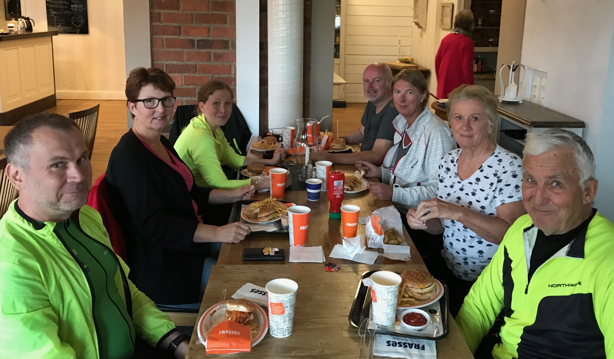

En turfträff kan ta sig många olika former: spontan eller uppstyrt, litet som stort, picnic eller pizzeria... Formen spelar liten roll, när det är turfarna och Turf som utgör kärnan.

I helgen bjöd roswes67 in till träff i Vännäs på Hotell Vännäs. Vilket blev ett ypperligt tillfälle för flera att ta lite unika zoner i omgivningarna. När regnet kom beställdes det burgare och utbyttes minnen och erfarenheter. Rooffiddler var kvällens långvägare, som dessutom fick sin Crowdy 5-medalj när vi avslutade träffen i [zonen Oskars](https://turfgame.com/zone/Oskars).

\[caption id="attachment\_246" align="alignnone" width="1884"\] Ett glatt gäng i Vännäs. Foto: ZoneBanger\[/caption\]

Stort tack till roswes67 för initiativ och inbjudan! Den 10 augusti träffas vi igen i Lycksele, där Brellir och Kyrkberget bjuder upp till turf. Turfa lugnt!

Vill du också arrangera en turfträff eller ett event på din ort? Ta [kontakt](https://turfvasterbotten.wordpress.com/kontakta-oss/) med styrelsen så hjälper vi att sprida ordet.

För rapporten: ZoneBanger & WombaWomba
