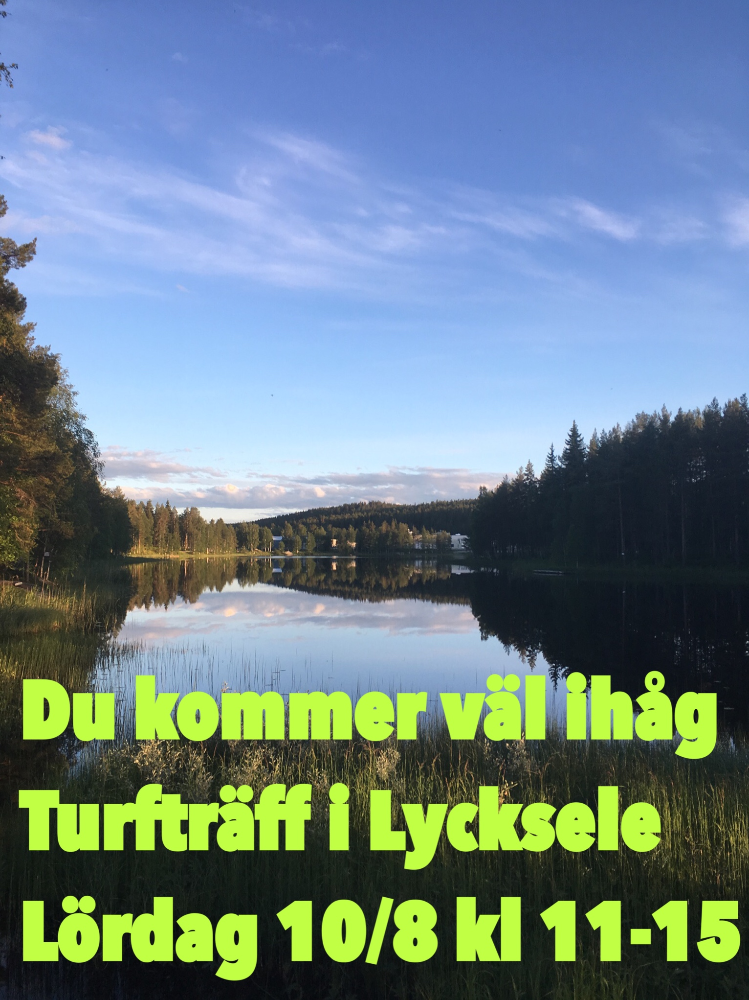

\[caption id="attachment\_258" align="aligncenter" width="548"\] Bild: Brellir.\[/caption\]

Vi träffas kl 11 vid zonen [LÅNGATJÄRNEN](https://turfgame.com/map/Långatjärnen).

Trevlig samvaro och möjlighet att äta medhavd lunch (eld finns såvida det inte är eldningsförbud).

Vid 12-tiden erbjuder vi guidade cykelturer, en lite längre, drygt 2 timmar och en kortare på drygt en timme samt en tur till fots på drygt en timme. Vid 14.30 tar vi en crowdy vid samlingszonen och bjuder på kaffe/te/saft och en kaka innan vi avslutar vid 15.

Varmt välkomna!

Reseinformation: Till Lycksele går det tåg och buss från Vännäs och Umeå, men med oregelbundna tider. Samåkning uppmuntras därför. Har du bil och plats för passagerare alternativt vill åka med någon, skriv en rad i chatten i Turf-appen eller i Facebook-gruppen för Turf Västerbotten.
