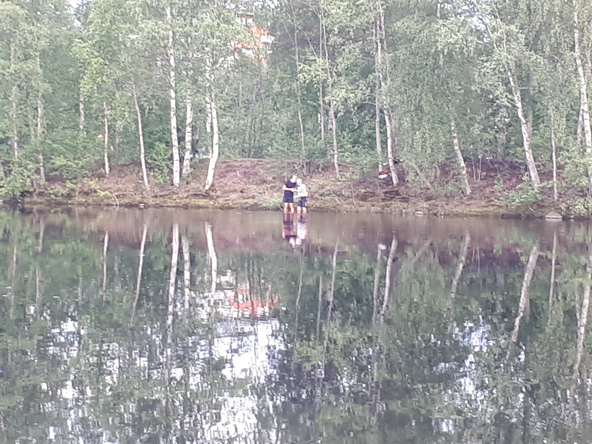

Ca 25 turfare träffades vid grillplatsen på  Bölesholmarna för att gratulera förra omgångens vinnare i regionen. Det pratades om allt från första zonen till statistik i de grupper som bildades runt elden.

Scott63 lämnade över vandringspriset till förra omgångens vinnare Sledge och passade på att informera om den pågående Klassikern och den kommande Sverigekampen i september.

Någon stor crowdy för Aquaman blev det inte. Mina barn hoppade i och tyckte att det var kallt. Turfaren eplkurt badade med son och hund men tog inte zonen…sen helt plötsligt är det två som ger sig iväg. PelSjo och Cykeltalibanen simmar ut till zonen och det är bara den sistnämda som får zonen. Dessa två herrar sitter sedan vid strandkanten (vi som står vid elden fryser av att bara titta på). När blocktiden går ut hoppar PelSjo i vattnet och simmar ut till zonen.

\[caption id="attachment\_772" align="aligncenter" width="4608"\] Foto: linkaz\[/caption\]

\[caption id="attachment\_770" align="aligncenter" width="4608"\] Badande herrar. Foto: linkaz\[/caption\]

Tack för en trevlig kväll alla som var med!

För rapporten: inda7

\[caption id="attachment\_780" align="alignnone" width="1952"\] Omgångsvinnaren Sledge med pokal. Foto: Scott63.\[/caption\]
