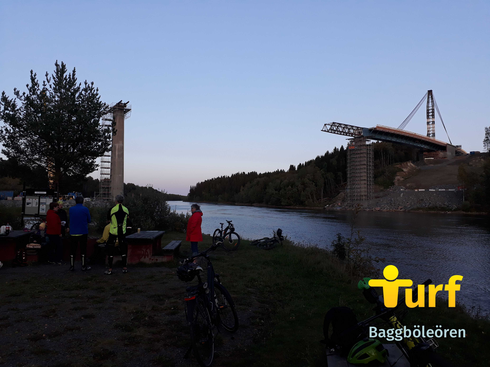
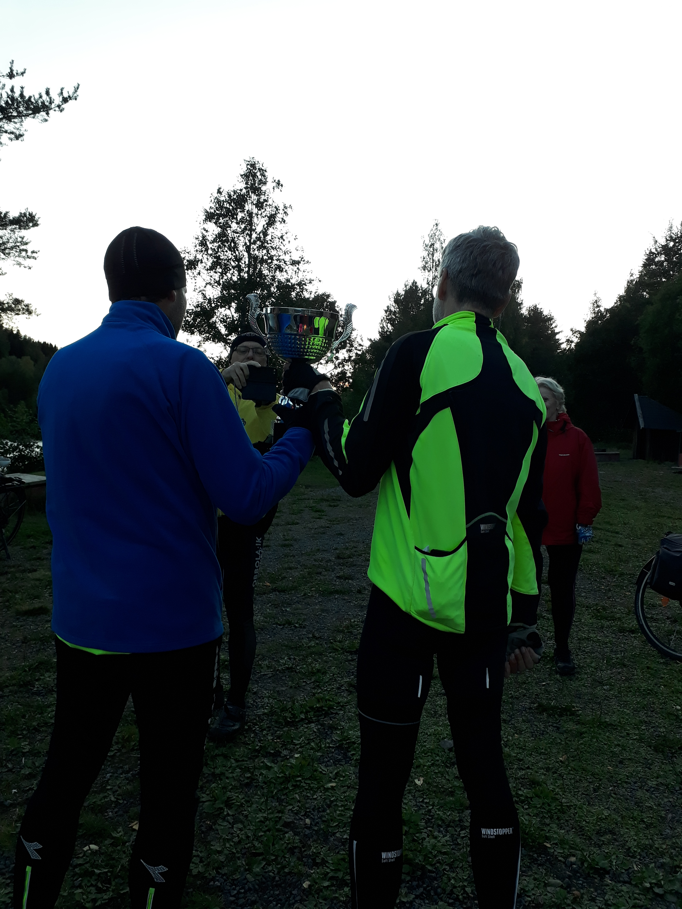

De senaste turf-träffarna i Umeå har vi försökt lägga på lite olika ställen i staden där det finns tillgång till grillplats. Det har varit ett gyllene tillfälle att fördela pph:n något jämnare. Nu när Sverigekampen pågår valde vi en zon lite längre bort och med Umeå-mått mätt hög take-point (140). Det blev en samling på 11 turfare på [Baggböleören](https://turfgame.com/map/Baggböleören) som grillade och beskådade brobygget till Norra Länken på nära håll.

Snart kommer en ny bro gå över Umeälven. Foto: WombaWomba.

Och så överlämnades Västerbottens-pokalen, från Cykeltalibanen till Scott63. Därefter lämnade Scott63 över pokalen till TantLantz som satte den på huvudet (tyvärr fastnade detta inte på bild) och - något motvilligt - körde hem den ännu en gång.

Cykeltalibanen fick lämna pokalen till Scott63 som fått ännu en inskription på pokalen. Foto: ZoneBanger.

Vi grunnade på hur vi på enklast sätt kunde ta zonen [Tungspetsen](https://turfgame.com/map/Baggböleören). Det borde ju gå att simma över. Men så plaskade det till ordentligt i vattnet. Kanske var det en haj, föreslog någon. Det var nog en stor lax, men vi tog det säkra före det osäkra. Den yngsta turfaren såg dock till att kasta flertalet stenar i vattnet för att skrämma bort eventuella vattenodjur.

ZoneBanger dokumenterar pokalöverlämningen. Foto: WombaWomba.

Kväll vid älven. Foto: WombaWomba.
